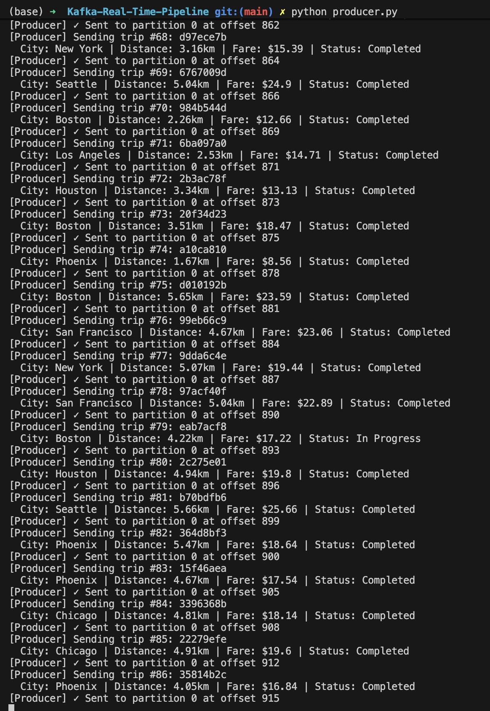
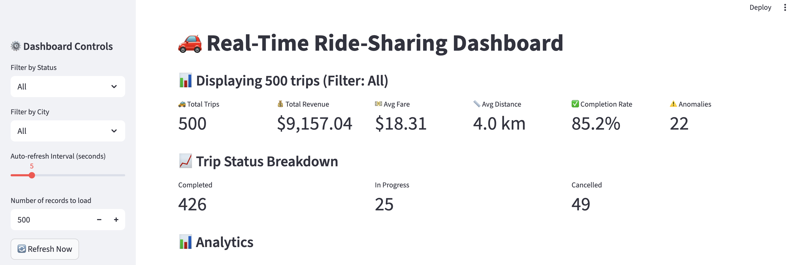
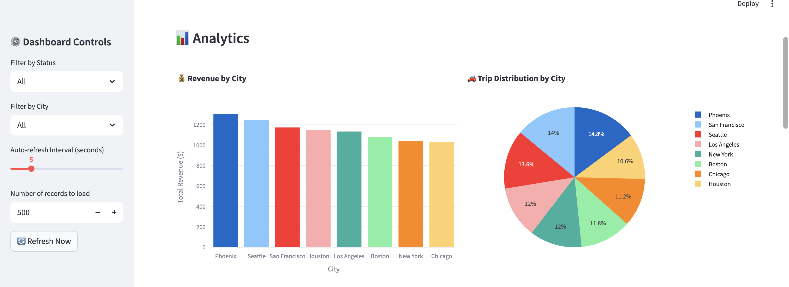
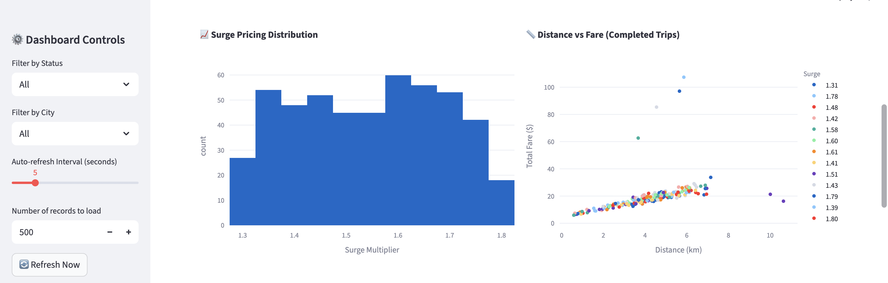
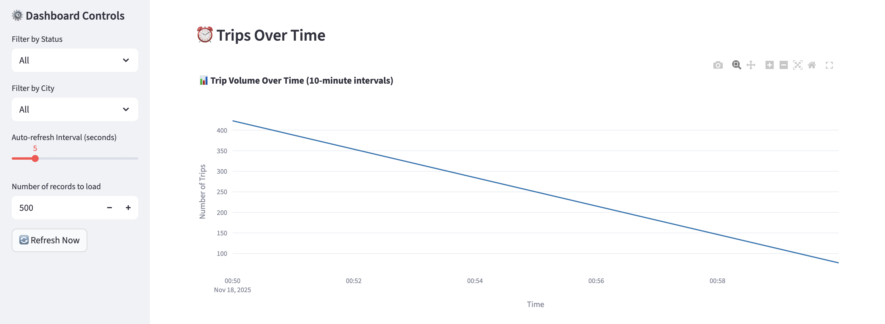
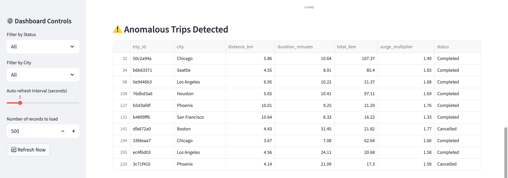
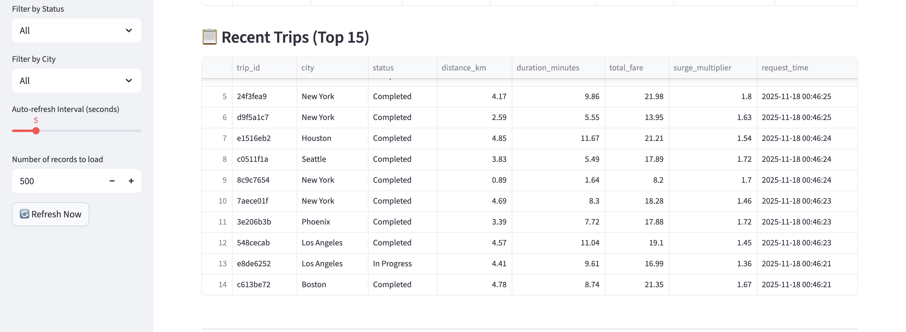
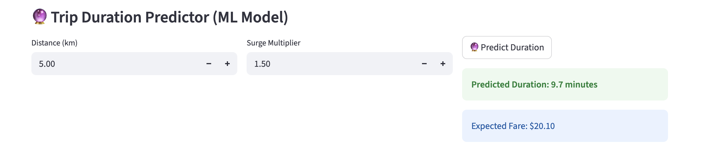
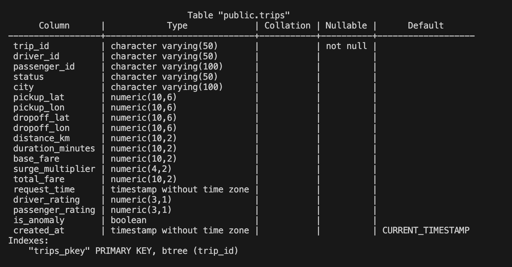

# Real-Time Ride-Sharing Data Streaming System using Apache Kafka

## Project Overview

This project implements a real-time data streaming pipeline for ride-sharing trips using Apache Kafka, PostgreSQL, and Streamlit. The system generates synthetic trip data, streams it through Kafka, stores it in a database, and visualizes it on a live dashboard with machine learning-based trip duration prediction.

---

## Technologies Used

- **Apache Kafka**: Real-time event streaming
- **PostgreSQL**: Data persistence
- **Streamlit**: Interactive dashboard
- **Python**: Data generation and processing
- **Scikit-learn**: Machine learning (trip duration prediction)
- **Docker**: Containerization for Kafka and PostgreSQL

---

## Features

1. **Synthetic Data Generation**: Creates realistic ride-sharing trip events in `producer.py` with:
   - Geographic coordinates (8 US cities)
   - Dynamic surge pricing based on time of day
   - Distance calculation
   - Driver and passenger ratings
   - Anomaly injection (5% of trips)
   - Surge Pricing**: Rush hours (7-9 AM, 5-7 PM): 1.5x - 2.5x, Late night (11 PM - 3 AM): 1.3x - 1.8x, Normal hours: 1.0x - 1.2x
   - Fare Calculation: `(base_fare + distance*rate + duration*rate) * surge`

   Below is what the trip generation looks like:

   


2. **Real-Time Streaming**: 
   - Kafka producer sends trips every 0.5-2 seconds
   - Kafka consumer processes and stores in PostgreSQL in `consumer.py`
   - Live dashboard updates every 5 seconds


3. **Live Dashboard Visualizations**:
   - 6 KPI metrics (trips, revenue, avg fare, distance, completion rate, anomalies)
   - Revenue by city (bar chart)
   - Trip distribution (pie chart)
   - Surge pricing distribution (histogram)
   - Distance vs Fare scatter plot
   - Time series of trip volume
   - Anomalous trips detection table
   - Recent trips data table

4. **Machine Learning** (Bonus):
   - Trip duration prediction model (Random Forest)
   - Predicts trip duration based on distance and surge multiplier
   - Interactive prediction interface on dashboard (Enter distance (e.g., 5.0 km), enter surge multiplier (e.g., 1.5), click "Predict Duration", See predicted duration and expected fare)


**Performance** (on 1,938 trips):
- R² Score: 0.588
- Mean Absolute Error: 1.50 minutes
- Average trip duration: 7.80 minutes

---

## Project Structure

```
Kafka-Real-Time-Pipeline/
├── docker-compose.yml       # Kafka & PostgreSQL setup
├── producer.py              # Kafka producer (generates trips)
├── consumer.py              # Kafka consumer (stores in DB)
├── dashboard_fixed.py       # Streamlit dashboard
├── duration_model.py        # ML model training script
├── duration_model.pkl       # Trained ML model (generated)
└── README.md               # This file
```

---

## Streamlit Dashboard UI

Below is what the live dashboard looks like!









---

## Setup Instructions

### Step 1: Install Python Dependencies

```bash
pip install kafka-python faker numpy pandas plotly streamlit psycopg2-binary scikit-learn joblib
```

### Step 2: Start Docker Services

```bash
# Start Kafka and PostgreSQL
docker-compose up -d

# Wait 30 seconds for services to initialize
sleep 30

# Verify services are running
docker ps
```

You should see `kafka` and `postgres` containers running.

### Step 3: Create Kafka Topic

```bash
docker exec -it kafka kafka-topics --create \
  --topic trips \
  --bootstrap-server localhost:9092 \
  --partitions 1 \
  --replication-factor 1
```

Verify the topic was created:

```bash
docker exec -it kafka kafka-topics --list --bootstrap-server localhost:9092
```

### Step 4: Run the System

Open **3 separate terminals**:

**Terminal 1 - Start Consumer:**
```bash
python consumer.py
```

**Terminal 2 - Start Producer:**
```bash
python producer.py
```

**Terminal 3 - Start Dashboard:**
```bash
streamlit run dashboard_fixed.py
```

The dashboard will open automatically.

### Step 5: Train ML Model

```bash
python duration_model.py
```

Restart the dashboard to see the trip duration predictor.


### Check Data in Database

**View database schema:**
```bash
docker exec -it postgres psql -U kafka_user -d kafka_db -c "\d trips"
```
You should see something similar to the image below:




## Conclusion

This project successfully demonstrates a production-ready real-time data streaming system that processes ride-sharing trips through Apache Kafka, stores data in PostgreSQL, and visualizes insights on a live dashboard. By implementing machine learning-based trip duration prediction alongside anomaly detection, the system showcases how streaming architectures can create intelligent, data-driven applications that provide immediate value to users. This end-to-end pipeline highlights the critical role of real-time data processing in modern applications, where timely insights and predictions enable better decision-making for both service providers and customers.
